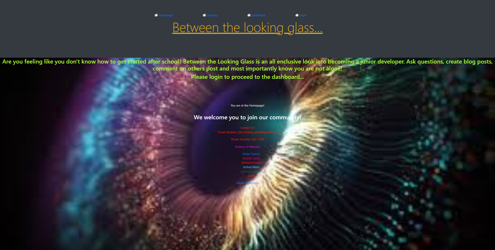

# Between-The-Looking-Glass

## Description
Between the Looking Glass is going to self-serve as a stand-alone full stack 
application that allows jr. developers, a place to feel at home. We called it 
Between the Looking Glass because that is exactly what the application will 
serve as in several ways. A looking glass into new opportunities available to 
all.   

First, the site will serve as a resource. The site will provide the users an 
extraordinary amount of information by providing them with programming 
topics, coding basics, and a glossary of useful terms every coder should know
and understand.    

Second, the site seeks to engage its users by creating a sense of community. 
The site will allow for comments and responses, or even up-voting certain 
discussions. The hopes for these features are to actively engage the user-
base as a collective of knowledge to facilitate learning.   

Finally, the site aims to provide as a catch-all by providing recent articles and
news updates for everything happening around the industry. This may come 
in the form of new job openings, breaking news, etc...
To summarize, we hope Between the Looking Glass provides the users a one-
stop-shop for gathering all the information they would need to be 
continuously engaged in their passion at hand!   

## Table of Contents
  * [Installation](#installation)
  * [Usage](#usage)
  * [Links](#links)
  * [Contributions](#contributions)
  * [Questions](#questions)

## Screenshot of application

  
  
## Installation

Make sure to have node.js installed before running application:
https://nodejs.org/en/download/package-manager/

## Usage

  * Access our deployed application at this URL: (https://dry-temple-13792.herokuapp.com/)

## Links
 
  * Github Repository URL: (https://github.com/kristafrancis/between-the-looking-glass)

## Contributions

  Fork, request, or contact me at the details below.
  

## Questions

For any and all questions, don't hesitate to reach out to us via the links in the footer of our deployed application on the homepage.

## Contributors
Krista Francis, Joshua Ward, Michael Bishop, Andrea Jared, Julia Coronado, Anthony Winston

